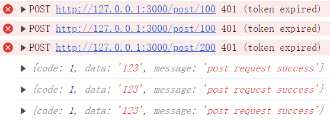
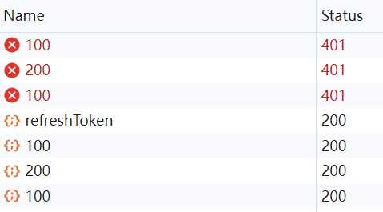

# Axios

> Axios 是一个基于promise的HTTP库，可以用在浏览器和node.js中。

### 安装

```bash
yarn add axios

# or
npm i axios -S
```

### 基本使用

```javascript
/**
 * 1、基础使用1
 * axios(config)
 * 2、基础使用2，url不在配置中指定
 * axios(url[, config])
 * 3、默认请求方法别名
 * 使用别名方法时，url、method、data 这些属性都不必在配置中指定。
 * axios.request(config)
 * axios.get(url[, config])
 * axios.delete(url[, config])
 * axios.head(url[, config])
 * axios.post(url[, data[, config]])
 * axios.put(url[, data[, config]])
 * axios.patch(url[, data[, config]])
 * 4、并发
 * axios.all(iterable)
 * axios.spread(callback)
 * 例：
 * let axiosList=[
 *    axios.get('url1', { params: 'xxx' }),
 *    axios.get('url2', { params: 'xxx' })
 * ]
 * axios.all(axiosList).then(axios.spread((res1, res2) => {
 *   console.log(res1, res2) // 分别是两个请求的返回值
 * })
 * 5、创建实例
 * axios.create([config])
 */

/**
 * promise方式
 */
function get () {
  // GET请求参数名必须是params，URL参数，可参考详细配置
  axios.get('/user', {
      params: {
        ID: '12345'
      }
    })
    .then(res => {
      console.log(res)
    })
    .catch(err => {
      console.log(err)
    })
}
function post () {
  axios.post('/user', {
      firstName: 'Fred',
      lastName: 'Flintstone'
    })
    .then(res => {
      console.log(res)
    })
    .catch(err => {
      console.log(err)
    })
}
/**
 * async/await方式
 */
async function gets () {
  try {
    let data1 = await axios.get('url1', { params: 'xxx' })
    let data2 = await axios.get('url2', { params: 'xxx' })
    console.log(data1, data2)
  } catch (error) {
    console.log(error)
  }
}
```

### 常用配置

```javascript
import axios from 'axios'
import qs from 'qs'

/**
 * axios config
 */
// url 前缀
axios.defaults.baseURL = process.env.NODE_ENV === 'production' ? '/web/' : '/api/'
// 跨域请求时携带cookie
axios.defaults.withCredentials = true
/**
 * axios 默认 Content-Type: application/json;charset=UTF-8
 * 请求正文为Request Payload，格式是json格式的字符串，需要用 @RequestBody 方式接收参数
 * 
 * 如果后端使用 @RequestParam 方式接收，配置transformRequest，参数使用qs转换
 * 请求头Content-Type会被设置为: Content-Type: application/x-www-form-urlencoded;charset=UTF-8
 * 请求正文为Form Data，格式是key=value&key1=value2
 * 后端接收对象参数，无需任何注解可自动转换接收
 */
// 请求参数转转换，{ a: 123, b: 'str' } => a=123&b=str
axios.defaults.transformRequest = [params => qs.stringify(params)]
// 请求统一额外参数
axios.defaults.params = { apiuser: 'debug' }
// 请求拦截器
axios.interceptors.request.use(config => {
  // 请求发出前，可以开始加载动画之类的操作
  return config
}, error => {
  // 请求发出错误处理
  return Promise.reject(error)
})
// 响应拦截器
axios.interceptors.response.use(response => {
  // 接收到响应处理，停止加载动画之类操作
  // 只返回后端返回的结果，即：response.data
  return response.data
}, error => {
  // 响应错误处理，统一异常处理
  console.log(error.stack)
  return Promise.reject(error)
})
```

### 使用全局默认配置，特殊使用时配置

> 使用了上述全局配置之后，请求头Content-Type会被设置为: application/x-www-form-urlencoded
> 如果上传文件需要将Content-Type设置为multipart/form-data，具体使用如下所示

```javascript
/**
 * 使用axios上传文件，ajax文件上传
 */
// input(type="file" onchange="fileChange" multiple="multiple")
// 设置multiple可以选择多个文件
function fileChange (e) {
  // 获取文件对象数组
  let files = e.target.files
  // 创建一个FormData，存储需要提交的表单数据，如果通过ajax方式上传文件，必须使用FormData
  let formData = new FormData()
  // 普通表单数据
  formData.append('num', 123)
  formData.append('name', 'aa')
  // 文件数据
  formData.append('file', files[0])
  // 多个文件数据需要遍历放入
  for (let f of files) {
    formData.append('files', f)
  }
  // 上传data必须转为formData
  axios.post('/upload', formData, {
    // 覆盖默认设置中的transformRequest设置
    transformRequest: [(params, headers) => {
      // 请求头Content-Type 为multipart/form-data
      headers = {
        'Content-Type': 'multipart/form-data'
      }
      // 取消qs参数转换
      return params
    }],
    // 上传进度
    onUploadProgress ({ loaded, total }) {
      let p = (loaded / total * 100).toFixed(0) + '%'
      console.log(p)
    }
  }).then(res => console.log(res))
}
```

### 详细配置

```javascript
{
  // `url` 是用于请求的服务器 URL
  url: '/user',

  // `method` 是创建请求时使用的方法
  method: 'get', // 默认是 get

  // `baseURL` 将自动加在 `url` 前面，除非 `url` 是一个绝对 URL。
  // 它可以通过设置一个 `baseURL` 便于为 axios 实例的方法传递相对 URL
  baseURL: 'https://some-domain.com/api/',

  // `transformRequest` 允许在向服务器发送前，修改请求数据
  // 只能用在 'PUT', 'POST' 和 'PATCH' 这几个请求方法
  // 后面数组中的函数必须返回一个字符串，或 ArrayBuffer，或 Stream
  transformRequest: [function (data) {
    // 对 data 进行任意转换处理

    return data;
  }],

  // `transformResponse` 在传递给 then/catch 前，允许修改响应数据
  transformResponse: [function (data) {
    // 对 data 进行任意转换处理

    return data;
  }],

  // `headers` 是即将被发送的自定义请求头
  headers: {'X-Requested-With': 'XMLHttpRequest'},

  // `params` 是即将与请求一起发送的 URL 参数
  // 必须是一个无格式对象(plain object)或 URLSearchParams 对象
  params: {
    ID: 12345
  },

  // `paramsSerializer` 是一个负责 `params` 序列化的函数
  // (e.g. https://www.npmjs.com/package/qs, http://api.jquery.com/jquery.param/)
  paramsSerializer: function(params) {
    return Qs.stringify(params, {arrayFormat: 'brackets'})
  },

  // `data` 是作为请求主体被发送的数据
  // 只适用于这些请求方法 'PUT', 'POST', 和 'PATCH'
  // 在没有设置 `transformRequest` 时，必须是以下类型之一：
  // - string, plain object, ArrayBuffer, ArrayBufferView, URLSearchParams
  // - 浏览器专属：FormData, File, Blob
  // - Node 专属： Stream
  data: {
    firstName: 'Fred'
  },

  // `timeout` 指定请求超时的毫秒数(0 表示无超时时间)
  // 如果请求话费了超过 `timeout` 的时间，请求将被中断
  timeout: 1000,

  // `withCredentials` 表示跨域请求时是否需要使用凭证
  withCredentials: false, // 默认的

  // `adapter` 允许自定义处理请求，以使测试更轻松
  // 返回一个 promise 并应用一个有效的响应
  adapter: function (config) {
    /* ... */
  },

  // `auth` 表示应该使用 HTTP 基础验证，并提供凭据
  // 这将设置一个 `Authorization` 头，覆写掉现有的任意使用 `headers` 设置的自定义 `Authorization`头
  auth: {
    username: 'janedoe',
    password: 's00pers3cret'
  },

  // `responseType` 表示服务器响应的数据类型，可以是 'arraybuffer', 'blob', 'document', 'json', 'text', 'stream'
  responseType: 'json', // 默认的

  // `xsrfCookieName` 是用作 xsrf token 的值的cookie的名称
  xsrfCookieName: 'XSRF-TOKEN', // default

  // `xsrfHeaderName` 是承载 xsrf token 的值的 HTTP 头的名称
  xsrfHeaderName: 'X-XSRF-TOKEN', // 默认的

  // `onUploadProgress` 允许为上传处理进度事件
  onUploadProgress: function (progressEvent) {
    // 对原生进度事件的处理
  },

  // `onDownloadProgress` 允许为下载处理进度事件
  onDownloadProgress: function (progressEvent) {
    // 对原生进度事件的处理
  },

  // `maxContentLength` 定义允许的响应内容的最大尺寸
  maxContentLength: 2000,

  // `validateStatus` 定义对于给定的HTTP 响应状态码是 resolve 或 reject  promise 。如果 `validateStatus` 返回 `true` (或者设置为 `null` 或 `undefined`)，promise 将被 resolve; 否则，promise 将被 rejecte
  validateStatus: function (status) {
    return status >= 200 && status < 300; // 默认的
  },

  // `maxRedirects` 定义在 node.js 中 follow 的最大重定向数目
  // 如果设置为0，将不会 follow 任何重定向
  maxRedirects: 5, // 默认的

  // `httpAgent` 和 `httpsAgent` 分别在 node.js 中用于定义在执行 http 和 https 时使用的自定义代理。允许像这样配置选项：
  // `keepAlive` 默认没有启用
  httpAgent: new http.Agent({ keepAlive: true }),
  httpsAgent: new https.Agent({ keepAlive: true }),

  // 'proxy' 定义代理服务器的主机名称和端口
  // `auth` 表示 HTTP 基础验证应当用于连接代理，并提供凭据
  // 这将会设置一个 `Proxy-Authorization` 头，覆写掉已有的通过使用 `header` 设置的自定义 `Proxy-Authorization` 头。
  proxy: {
    host: '127.0.0.1',
    port: 9000,
    auth: {
      username: 'username',
      password: 'password'
    }
  },

  // `cancelToken` 指定用于取消请求的 cancel token
  // （查看后面的 Cancellation 这节了解更多）
  cancelToken: new CancelToken(function (cancel) {
  })
}
```

### axios实现前端无感刷新token

  
  

> 主要依赖axios响应拦截处理  
> 其实这个场景后端处理更为妥当，此处仅供学习参考  

```javascript
// axios默认全局配置
axios.defaults.transformRequest = [params => Qs.stringify(params)]
// 创建请求实例，以及默认配置
const request = axios.create({
  timeout: 1000 * 30,
  baseURL: 'http://127.0.0.1:3000',
  responseType: 'json'
})
// 实例化模拟的store，这里可以结合localStorage, cookies等
const store = new Store('expire', 'refresh') // 两个参数未模拟的token
// 刷新token请求
const refreshTokenRequest = () => new Promise(async (resolve, reject) => {
  try {
    const { code, data, message } = await request.post('/refreshToken', null, {
      headers: { Refresh: store.getRefreshToken() }
    }) || {}
    code === 1 && data ? resolve(data) : reject(new Error(message))
  } catch (error) {
    reject(error)
  }
})
// 全局请求拦截
request.interceptors.request.use(config => {
  // header中设置token
  config.headers['Token'] = store.getToken()
  return config
}, error => {
  // 请求发出错误处理
  return Promise.reject(error)
})
let isRefreshing = false // 当前是否正在请求刷新token
let wating = [] // 报401的接口，加入等待列表，刷新接口成功后统一请求
// 响应拦截
request.interceptors.response.use(response => {
  // 默认返回response的data
  return response?.data
}, async error => {
  const { config, response } = error || {}
  if (isRefreshing) {
    // 刷新token正在请求，把其他的接口加入等待数组
    return new Promise((resolve) => wating.push({ config, resolve }))
  }
  // 如果是401-Unauthorized，刷新token操作
  if (response?.status === 401) {
    isRefreshing = true
    try {
      // 根据refreshToken获取新的token和refreshToken
      const { token, refreshToken } = await refreshTokenRequest() || {}
      isRefreshing = false
      store.setToken(token)
      store.setRefreshToken(refreshToken)
      // 刷新token请求成功，等待数据的失败接口重新发起请求
      wating.forEach(({ config, resolve }) => resolve(request(config)))
      // 请求完之后清空等待请求的数组
      wating = []
      // 当前接口重新发起请求
      return request(config)
    } catch (error) {
      // 刷新token失败，重新登录
    }
  }
  return Promise.reject(error)
})

// DO TEST
async function doRequest() {
  request.post('/post/100').then(console.log)
  request.post('/post/200').then(console.log)
  request.post('/post/300').then(console.log)
}
doRequest()
```

> 其他代码，模拟store及后端代码  

```javascript
/* 模拟store */
function Store(token, refreshToken) {
  this.token = token
  this.refreshToken = refreshToken
}
Store.prototype.setToken = function(token) { this.token = token }
Store.prototype.getToken = function() { return this.token }
Store.prototype.setRefreshToken = function(refreshToken) { this.refreshToken = refreshToken }
Store.prototype.getRefreshToken = function() { return this.refreshToken }

/* 后端代码 */
const Koa = require('koa')
const Router = require('koa-router')
const cors = require('koa2-cors')
const bodyParser = require('koa-bodyparser')
const app = new Koa()
const router = new Router()
const TOKENS = { normal: 'normal', expire: 'expire', refresh: 'refresh' }
const checkToken = token => token === TOKENS.normal
const getNewToken = refresh => refresh === TOKENS.refresh ? { token: TOKENS.normal, refreshToken: TOKENS.refresh } : null
const sleep = timeout => new Promise((resolve, reject) => setTimeout(resolve, timeout))
router.post('/refreshToken', async (ctx, next) => {
  const newToken = getNewToken(ctx.request.headers.refresh)
  await sleep(1000)
  ctx.response.body = newToken ? { code: 1, data: newToken, message: 'success' } : { code: 0, message: 'token error' }
})
router.post('/post/:timeout', async (ctx, next) => {
  await sleep(+(ctx.params.timeout || 0))
  if (!checkToken(ctx.request.headers.token)) {
    ctx.response.status = 401
    ctx.response.message = 'token expired'
  } else {
    ctx.response.body = { code: 1, data: '123', message: 'post request success' }
  }
})
app.use(cors({
  origin: '*',
  credentials: true,
  allowMethods: ['GET', 'POST', 'PUT', 'DELETE', 'OPTIONS'],
  allowHeaders: ['Content-Type', 'Accept', 'X-Requested-With', 'Token', 'Refresh']
}))
app.use(bodyParser())
app.use(router.routes())
app.use(router.allowedMethods())
app.listen(3000)
console.log('启动成功，端口：3000')
```