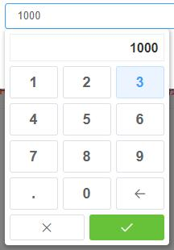

# JavaScript代码片段收藏

> 1、[同时生成条码二维码](#1、同时生成条码二维码)  
> 2、[批量下载图片](#2、批量下载图片)  
> 3、[导出Excel](#3、导出excel)  
> 4、[解析Excel，修改后导出](#4、解析excel，修改后导出)  
> 5、[vue-router@3.x部署更新提示](#5、vue-router3x部署更新提示)  
> 6、[vue指令，右键打开数字软键盘](#6、vue指令，右键打开数字软键盘)  

##### 1、同时生成条码二维码


> 使用```jsbarcode```生成条形码，```qrcode```生成二维码  
> 使用canvas合并生成的条形码、二维码  

```javascript
import JsBarCode from 'jsbarcode'
import QRCode from 'qrcode'

/**
 * 生成条码Promise，仅条形码可以生成内容
 */
const getBarCodePromise = code => {
  return new Promise((resolve, reject) => {
    try {
      const canvas = document.createElement('canvas')
      // 根据字符长度计算条码高度
      let h = code.length * 80
      if (h > 360) h = 360
      else if (h < 120) h = 120
      JsBarCode(canvas, code, {
        format: 'CODE39',
        text: `${code}`.split('').join(' '), // 条码内容增加空格间隔
        font: 'Microsoft YaHei',
        fontOptions: 'bold',
        fontSize: 120,
        width: 6, // 宽度是条码内容format之后的串的间隔，可参照文档或源码
        height: h, // 内容越长高度显得越小，可通过上面简单高度计算以及限制
        margin: 10
      })
      // 生成图片对象
      const img = new Image()
      img.setAttribute('crossOrigin', 'anonymous') // 设置允许跨域访问
      img.onload = () => {
        // 图片加载完之后resolve
        resolve(img)
      }
      img.src = canvas.toDataURL('image/png')
    } catch (error) {
      reject(error)
    }
  })
}
/**
 * 生成二维码Promise
 */
const getQrCodePromise = code => {
  return new Promise((resolve, reject) => {
    try {
      // 生成base64
      QRCode.toDataURL(code, {
        errorCorrectionLevel: 'H',
        version: 4,
        maskPattern: 7,
        margin: 1,
        width: 500
      }, (e, url) => {
        // 生成图片对象
        const img = new Image()
        img.setAttribute('crossOrigin', 'anonymous') // 设置允许跨域访问
        img.onload = () => {
          // 图片加载完之后resolve
          resolve(img)
        }
        img.src = url
      })
    } catch (error) {
      reject(error)
    }
  })
}
/**
 * 合并生成条码二维码图片并返回base64图片
 * @param {String} code
 * @return {String} base64
 */
export default code => {
  // 生成条码，并加载到Image对象中resolve
  const barCodePromise = getBarCodePromise(code)
  // 生成二维码，并加载到Image对象中resolve
  const qrCodePromise = getQrCodePromise(code)
  // 合并图片
  return new Promise((resolve, reject) => {
    Promise.allSettled([barCodePromise, qrCodePromise]).then(([{ value: barImg }, { value: qrImg }]) => {
      try {
        if (barImg && qrImg) {
          // 使用canvas合并图片
          const canvas = document.createElement('canvas')
          const ctx = canvas.getContext('2d')
          canvas.width = barImg.width
          canvas.height = barImg.height + barImg.width
          // 竖向排列条码、二维码
          ctx.drawImage(barImg, 0, 0, barImg.width, barImg.height)
          ctx.drawImage(qrImg, 0, barImg.height, barImg.width, barImg.width)
          // 生成图片url
          const url = canvas.toDataURL('image/png')
          // resolve合并后base64
          resolve(url)
        } else {
          reject(new Error(`生成二维码失败：${code}`))
        }
      } catch (error) {
        reject(error)
      }
    }).catch(reject)
  })
}
```

##### 2、批量下载图片

> 使用```jszip```批量下载图片zip文件  

```javascript
import ZIP from 'jszip'
import drawCode from './draw-code' // 1 中生成图片base64的方法

export default = codeArr => {
  // loading start
  const zip = new ZIP()
  const promises = codeArr.map(code => new Promise((resolve, reject) => {
    // 图片生成base64，此处使用 1 中方法，也可通过canvas的toDataURL将图片转为base64
    drawCode(code).then(url => {
      const [, data] = url.split(',')
      // zip.file第一个参数为key，不能重复
      zip.file(`条码二维码/${code}_条形码_二维码.png`, data, { base64: true })
      resolve()
    }).catch(reject)
  }))
  Promise.all(promises).then(() => {
    zip.generateAsync({ type: 'blob' }).then(data => {
      const url = window.URL.createObjectURL(data)
      const link = document.createElement('a')
      link.href = url
      link.setAttribute('download', '批量生成条码二维码.zip')
      link.click()
      // 回收URL
      window.URL.revokeObjectURL(url)
    })
  }).finally(() => {
    // loading end
  })
}
```

##### 3、导出Excel

> 使用```xlsx```导出excel  
> 并将数据每60000条切分，单独生成一个sheet页  
> ```splitArray```切分数组[可参照](./js-utils.md#切分数组) 

```javascript
import XLSX from 'xlsx'

/**
 * 导出Excel
 */
export const exportExcel = (data, name) => {
  if (!name) name = `${Date.now()}.xlsx`
  const wb = XLSX.utils.book_new()
  const ws = XLSX.utils.aoa_to_sheet(data)
  XLSX.utils.book_append_sheet(wb, ws, 'SheetJS')
  XLSX.writeFile(wb, name)
}

/**
 * 导出Excel，多sheet页
 */
export const exportExcel = (datas, name) => {
  if (!name) name = `${Date.now()}.xlsx`
  const wb = XLSX.utils.book_new()
  const sheets = Object.keys(datas)
  for (const s of sheets) {
    const ws = XLSX.utils.aoa_to_sheet(datas[s])
    XLSX.utils.book_append_sheet(wb, ws, s)
  }
  XLSX.writeFile(wb, name)
}

/**
 * 导出excel，超过60000条自动分sheet页
 * @param {*} data
 * @param {*} name
 */
export const exportExcel = (data, name) => {
  if (!name) name = `${Date.now()}.xlsx`
  const wb = XLSX.utils.book_new()
  const header = data[0]
  const arr = splitArray(data, 60000)
  for (let i = 0; i < arr.length; i++) {
    const d = arr[i]
    if (i > 0) {
      d.unshift(header)
    }
    const ws = XLSX.utils.aoa_to_sheet(d)
    XLSX.utils.book_append_sheet(wb, ws, `Sheet${i + 1}`)
  }
  XLSX.writeFile(wb, name)
}
```

##### 4、解析Excel，修改后导出

> 使用excel公式 ```{ t:'n', f: 'excel公式' }```  
> 使用excel公式导出后需要启用编辑公式才能生效  

```javascript
/*
<form id="formWrap">
  <input type="file" id="fileInput" />
</form>
*/
import XLSX from 'xlsx'

const formWrap = document.getElementById('formWrap')
const keys = ['id', 'productCode', 'printePrice', 'paperPrice', 'totalPrice', 'totalTechfee', '误差']
function dataArrange (items, arr) {
  arr.forEach((item, index) => {
    try {
      const reqinfo = JSON.parse(item.reqinfo)
      const resinfo = JSON.parse(item.resinfo)
      const { productCode } = reqinfo.data
      const { printePrice, paperPrice, totalPrice, totalTechfee } = resinfo.data
      items.push([
        item.id,
        productCode,
        printePrice,
        paperPrice,
        totalPrice,
        totalTechfee,
        { t:'n', f: `=ROUND(E${index + 2}-C${index + 2}-D${index + 2}-F${index + 2}, 2)` } // 使用excel公式
      ])
    } catch (error) {
    }
  })
}
document.getElementById('fileInput').onchange = e => {
  const [file] = e.target.files
  if (!file) return
  const reader = new FileReader()
  reader.onload = ({ target }) => {
    const data = new Uint8Array(target.result)
    const workbook = XLSX.read(data, { type: 'array' }) // 读取excel文件
    const worksheet = workbook.Sheets[workbook.SheetNames[0]] // 取第一个sheet页
    const dataArr = XLSX.utils.sheet_to_json(worksheet) // 将数据转为json
    const items = [keys]
    dataArrange(items, dataArr)
    exportExcel(items, file.name) // 上面 3 中导出excel
    setTimeout(() => formWrap.reset(), 1) // 重置表单情况input file
  }
  reader.readAsArrayBuffer(file)
}
```

##### 5、vue-router@3.x部署更新提示

> ```vue-router@3.x```中检测网络异常提示  
> 加载资源失败时，提示重新加载（结合```Element-UI```）  

```javascript
this.$router.push({
  name,
  params,
  query
}).catch(e => {
  if (!navigator.onLine) {
    this.$msg.warning('网络异常，请检查网络连接！')
    return
  }
  /^Loading.*?failed./i.test(e.message) && this.$confirm('系统已更新，需要刷新重新加载页面！', '提示', {
    type: 'warning',
    confirmButtonText: '刷新',
    showCancelButton: false,
    closeOnHashChange: false
  }).then(() => {
    location.reload()
  }).catch(() => {})
})
```

##### 6、vue指令，右键打开数字软键盘



> 数字软键盘指令，配合ElementUI InputNumber、Input组件使用  
> 注册指令：Vue.directive('num-input', NumInput)  
> 使用指令：&#60;InputNumber v-num-input />  

```javascript
import Vue from 'vue'
import NumBox from './main.vue'

const NumBoxConstructor = Vue.extend(NumBox)

// 软键盘实例，只生成一个到body
let instance
const initInstance = () => {
  instance = new NumBoxConstructor({
    el: document.createElement('div')
  })
  document.body.appendChild(instance.$el)
}

export default {
  bind (el, binding, vnode) {
    if (!instance) {
      initInstance()
    }
    // 右键打开数字软键盘，触摸设备长按激活
    el.addEventListener('contextmenu', e => {
      e.preventDefault()
      const { top, left, height } = el.getBoundingClientRect()
      instance.position = { top: top + height, left }
      instance.vnode = vnode.child
      instance.value = vnode.child.value || ''
      setTimeout(() => {
        instance.visible = true
      }, 1)
    })
  }
}
```

```html
<template>
  <transition name="num-box-fade">
    <div v-show="visible" class="num-box-container" :style="positionStyle" @click="clickHandle">
      <div class="show-box">
        <span v-text="value"></span>
      </div>
      <div class="input-box">
        <Button @click="() => inputHandle('1')">1</Button>
        <Button @click="() => inputHandle('2')">2</Button>
        <Button @click="() => inputHandle('3')">3</Button>
        <Button @click="() => inputHandle('4')">4</Button>
        <Button @click="() => inputHandle('5')">5</Button>
        <Button @click="() => inputHandle('6')">6</Button>
        <Button @click="() => inputHandle('7')">7</Button>
        <Button @click="() => inputHandle('8')">8</Button>
        <Button @click="() => inputHandle('9')">9</Button>
        <Button @click="() => inputHandle('.')">.</Button>
        <Button @click="() => inputHandle('0')">0</Button>
        <Button icon="el-icon-back" :disabled="value.length <= 0" @click="backspaceHandle"></Button>
      </div>
      <div class="operate-box">
        <Button icon="el-icon-close" @click="closeHandle"></Button>
        <Button icon="el-icon-check" type="success" @click="commitHandle"></Button>
      </div>
    </div>
  </transition>
</template>
<script>
import store from '@/store'

export default {
  name: 'NumBox',
  computed: {
    positionStyle ({ position }) {
      const { allWidth } = store.state.app.screen
      let { top, left } = position
      if (allWidth - left < 209) {
        left = allWidth - 209
      }
      return `top: ${top}px; left: ${left}px`
    }
  },
  data () {
    return {
      visible: false,
      position: {
        top: 0,
        left: 0
      },
      vnode: null, // InputNumber 虚拟节点
      value: '' // 当前输入的值
    }
  },
  mounted () {
    // 点击软键盘以外的区域关闭软键盘
    document.body.addEventListener('click', this.closeHandle)
    // esc 关闭软键盘
    document.body.addEventListener('keydown', this.escapeHandle)
  },
  beforeDestroy () {
    // 解除事件绑定
    document.body.removeEventListener('click', this.closeHandle)
    document.body.removeEventListener('keydown', this.escapeHandle)
  },
  methods: {
    // 确认输入
    commitHandle () {
      if (!this.vnode) return
      const { setCurrentValue, handleInput } = this.vnode
      // 调用InputNumber的setCurrentValue设置输入的值
      if (setCurrentValue) {
        setCurrentValue(this.value)
      } else if (handleInput) {
        handleInput({ target: { value: this.value } })
      }
      // 确认输入后关闭软键盘
      this.closeHandle()
    },
    // 输入处理，祖父穿拼接
    inputHandle (val) {
      this.value += val
    },
    // 退格键删除最后一个字符
    backspaceHandle () {
      const val = `${this.value}`
      if (val.length > 1) {
        this.value = val.substring(0, val.length - 1)
      } else {
        // 如果仅剩一个字符摁退格键时直接清空
        this.value = ''
      }
    },
    // 关闭数字软键盘
    closeHandle () {
      this.visible = false
      if (!this.vnode) return
      const { blur, focus, setCurrentValue } = this.vnode
      if (!setCurrentValue) {
        focus && focus()
        setTimeout(() => {
          blur && blur()
          this.vnode = null
        }, 100)
      } else {
        this.vnode = null
      }
    },
    // esc 关闭软键盘
    escapeHandle (e) {
      if (e.code === 'Escape') {
        this.closeHandle()
      }
    },
    // 数字软键盘点击时阻止冒泡，防止触发body事件关闭
    clickHandle (e) {
      e.stopPropagation()
    }
  }
}
</script>
<style lang="scss" scoped>
.num-box-container {
  position: fixed;
  z-index: 5000;
  padding: 6px;
  background-color: #FFF;
  border-radius: 4px;
  box-shadow: 1px 2px 4px 2px rgba(0, 0, 0, .2);
  .show-box {
    height: 34px;
    line-height: 34px;
    margin-bottom: 6px;
    overflow: hidden;
    font-size: 16px;
    font-weight: 600;
    width: 192px;
    display: flex;
    justify-content: flex-end;
    border: 1px solid #EEE;
    box-sizing: border-box;
    padding: 0 6px;
    user-select: none;
    span {
      text-align: right;
    }
  }
  .input-box {
    display: grid;
    grid-template-columns: repeat(3, 60px);
    grid-template-rows: repeat(4, 40px);
    grid-gap: 6px;
  }
  .operate-box {
    margin-top: 6px;
    display: grid;
    grid-template-columns: repeat(2, 93px);
    grid-template-rows: repeat(1, 32px);
    grid-gap: 6px;
    button {
      padding: 0;
    }
  }
  button {
    margin: 0;
    font-size: 18px;
    font-weight: 600;
  }
}
.num-box-fade-enter-active {
  -webkit-animation: num-box-fade-in .3s;
  animation: num-box-fade-in .3s;
}
.num-box-fade-leave-active {
  -webkit-animation: num-box-fade-out .3s;
  animation: num-box-fade-out .3s;
}
@-webkit-keyframes num-box-fade-in {
  0% {
    opacity: 0;
  }
  100% {
    opacity: 1;
  }
}
@keyframes num-box-fade-in {
  0% {
    opacity: 0;
  }
  100% {
    opacity: 1;
  }
}
@-webkit-keyframes num-box-fade-out {
  0% {
    opacity: 1;
  }
  100% {
    opacity: 0;
  }
}
@keyframes num-box-fade-out {
  0% {
    opacity: 1;
  }
  100% {
    opacity: 0;
  }
}
</style>
```