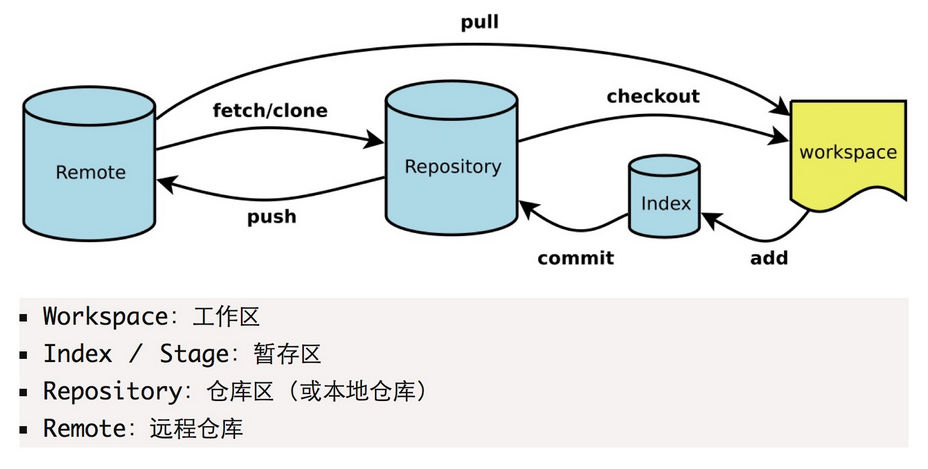
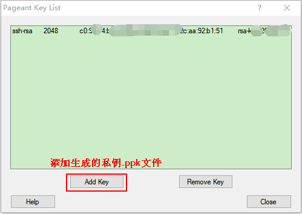

# Git常用命令



> 需要提前下载安装[Git客户端](https://git-scm.com/)  

### 常用操作

> **注意：git对文件名称大小写不敏感**  

```bash
################## clone ###################
# 克隆项目
git clone <git地址>
# 根据分支克隆
git clone -b <分支名> <git地址>

################### 提交 ####################
# 查看状态
git status

# 提交文件变化到暂存区
# 提交被修改(modified)和被删除(deleted)文件，不包括新文件(new)
git add -u
# 提交新文件(new)和被修改(modified)文件，不包括被删除(deleted)文件
git add .
# 提交所有变化
git add -A

# 提交文件至本地仓库区
git commit –m '<本次提交描述>'
# 以下两条命令相同，合并操作，提交文件变化，提交本地仓库区，等价于 git add . 之后 git commit –m '<本次提交描述>'
git commit –am '<本次提交描述>'
git commit –a –m '<本次提交描述>'

# 将本地版本库的分支推送到远程服务器
# git push <远程服务器> <分支>
git push origin master
# 无特殊配置为提交当前分支
git push

################### 更新 ####################
# 从远程拉取最新内容 
git fetch
# 将拉取下来的最新内容合并到当前分支
git merge

# git pull 等价于上面两步操作
# 但会对代码进行破坏性更新，建议使用 git fetch，git merge 进行代码更新
git pull
```

### 暂存

> 切换分支时存在未提交的文件，可以使用暂存  

```bash
# 添加暂存
git stash

# 查看暂存记录列表
git stash list

# 应用某个存储，但不会把该存储从列表中删除
# git stash apply
git stash apply stash@{0}

# 应用并删除某个存储
# git stash pop
git stash pop stash@{0}

# 删除某个存储
# git stash drop
git stash drop stash@{0}

# 清空所有暂存的 stash
git stash clear
```

### 分支

```bash
# 显示所有参数使用方法
git branch -h

# 查看所有分支，参数v显示版本号注释等附加信息，a显示所有
git branch -va
# * 开头的为当前本地分支，origin为远程分支
#   gh-pages                5c3cbe8 Create CNAME
# * master                  20575cc shouye
#   remotes/origin/HEAD     -> origin/master
#   remotes/origin/gh-pages 5c3cbe8 Create CNAME
#   remotes/origin/master   20575cc shouye
#   remotes/origin/test     20575cc shouye

# 创建分支
git branch <分支名>
# 提交分支到远程服务器
git push origin <分支名>

# 删除本地分支
git branch -d <分支名>
# 删除远程服务器分支
git push origin -d <分支名>

# 切换分支
git checkout <分支名>

# 创建并切换分支
git checkout -b <分支名>

# 拉取远程分支（首次拉取），本地没有
git fetch origin <分支名>
git checkout <分支名>
```

### git 回退版本

```bash
# 查看提交记录
git log
#commit <commit id 1> (HEAD -> master, origin/master)
#Author: <用户名> <邮箱>
#Date:   <时间>
#
#    <commit message 1>
#
#commit <commit id 2>
#Author: <用户名> <邮箱>
#Date:   <时间>
#
#    <commit message 2>

# 增加--pretty=oneline参数只显示commit id和commit message
git log --pretty=oneline
# <commit id 1> (HEAD -> master, origin/master) <commit message 1>
# <commit id 2> <commit message 2>

# 回退到指定commit id，这一步最好在当前代码 commit 之后操作，commit之后源代码可找回
# --soft 回退到某个版本
# --hard 撤销工作区中所有未提交的修改内容，将暂存区与工作区都回到上一次版本，并删除之前的所有信息提交
git reset --soft <commit id>
# HEAD is now at xxxxxx commit

# 强制提交
git push origin <分支名> --force
```

### git 恢复工作区文件

```bash
# 查看更改的文件
git status

# 如果add到暂存区需要reset，重置暂存区最近一次提交
# 如果已经commit，需要将文件回退到commit前
git reset HEAD <文件名>

# 恢复工作区文件
git checkout <文件名>
```

### git 找回删除的提交

```bash
# 用git log查询不到已经删除的commit id，可以使用git reflog
git reflog

# 00000000 (HEAD -> master, origin/master, origin/HEAD) HEAD@{0}: reset: moving to HEAD^
# xxxxxxxx HEAD@{1}: commit: test git reflog

# 拣选删除的commit到当前分支，git cherry-pick xxxxxxxx
git cherry-pick <commit id>
```

### git 忽略文件（本地）

```bash
# git项目根目录，编辑.git/info/exclude，添加需要忽略的文件
vim .git/info/exclude

# 如果已经包含未暂存的更改，需要运行
git update-index --skip-worktree [<file>...]

# 恢复更改跟踪，取消.git/info/exclude中的配置后，需要运行
git update-index --no-skip-worktree [<file>...]
```

### 提交gh-pages分支以供展示

```bash
# dist为打包后的文件目录
git subtree push --prefix dist origin gh-pages
```

### git log 图形化

```bash
git log --graph --pretty="(%p) %h %s"
```

### 统计贡献者代码行数

```bash
# --author="" 为贡献者，$(git config --get user.email)表示当前用户账号
git log --author="$(git config --get user.email)" --pretty=tformat: --numstat | gawk '{ add += $1; subs += $2; loc += $1 - $2 } END { printf "增加的行数:%s 删除的行数:%s 总行数: %s\n", add, subs, loc }'
```

### 使用配置

```bash
# 1、配置用户名
# 全局
git config --global user.name '<用户名>'
# 非全局，在项目根目录（.git文件夹所在的目录）
git config user.name '<用户名>'

# 2、配置邮箱
# 全局
git config --global user.email '<登录邮箱>'
# 非全局，在项目根目录（.git文件夹所在的目录）
git config user.email '<登录邮箱>'

# 3、生成密钥，与 步骤2 中邮箱相同
ssh-keygen -t rsa -C '<登录邮箱>'
  # (1) Enter file in which to save the key 第一次是密钥地址，输入直接回车
  # (2) Enter passphrase 第二次输入是密码
  # (3) Enter same passphrase again 第三次输入是确认密码

# 4、将生成的SSH公钥添加到GitLab或者GitHub或者码云等平台中
  # (1) 登录之后在 用户设置页面 -> SSH密钥
  # (2) 将 id_rsa.pub 中的公钥内容全部复制到 Key 文本域输入框（使用PuTTYgen生成私钥也添加到此处，PuTTYgen使用下面有介绍）
  # (3) 标题会自动生成也可以自行修改，添加密钥

# 5、开始使用
```

> **Git客户端工具[Sourcetree](https://www.sourcetreeapp.com/)**  
> ```C:\Users\<用户名>\AppData\Local\Atlassian\SourceTree```目录下创建```accounts.json```，内容如下  

```json
[
  {
    "$id": "1",
    "$type": "SourceTree.Api.Host.Identity.Model.IdentityAccount, SourceTree.Api.Host.Identity",
    "Authenticate": true,
    "HostInstance": {
      "$id": "2",
      "$type": "SourceTree.Host.Atlassianaccount.AtlassianAccountInstance, SourceTree.Host.AtlassianAccount",
      "Host": {
        "$id": "3",
        "$type": "SourceTree.Host.Atlassianaccount.AtlassianAccountHost, SourceTree.Host.AtlassianAccount",
        "Id": "atlassian account"
      },
      "BaseUrl": "https://id.atlassian.com/"
    },
    "Credentials": {
      "$id": "4",
      "$type": "SourceTree.Model.BasicAuthCredentials, SourceTree.Api.Account",
      "Username": "",
      "Email": null
    },
    "IsDefault": false
  }
]
```

> ```C:\Users\<用户名>\AppData\Local\Atlassian\SourceTree.exe_Url_*****\x.x.x.x\user.config```，在```</SourceTree.Properties.Settings>```节点前添加以下内容  

```xml
<setting name="AgreedToEULA" serializeAs="String">
    <value>True</value>
</setting>
<setting name="AgreedToEULAVersion" serializeAs="String">
    <value>20160201</value>
</setting>
```

> **Git客户端工具[TortoiseGit](https://tortoisegit.org/)**  

> 使用PuTTYgen生成密钥  


> 配置使用私钥使用，私钥文件为.ppk文件  




### Github速度慢优化方法

> 获取github域名最快访问ip，[https://github.com.ipaddress.com/](https://github.com.ipaddress.com/) 添加到hosts文件  
> [github.com](https://www.ipaddress.com/site/github.com)  
> [global-ssl.fastly.net](https://www.ipaddress.com/site/global-ssl.fastly.net)  
> [github.global.ssl.fastly.net](https://www.ipaddress.com/site/github.global.ssl.fastly.net)  

```bash
<获取的IP> github.com
<获取的IP> global-ssl.fastly.Net
<获取的IP> github.global.ssl.fastly.net
```

> Linux、Mac下修改```/etc/hosts```文件，修改完后执行  

```bash
# 在命令行中输入以下命令使hosts生效 -> Linux（可能需要安装 nscd）
nscd -i hosts

# 在命令行中输入以下命令使hosts生效 -> Mac（>=10.10.4）
sudo killall -HUP mDNSResponder
```

> Windows下修改 ```c:\Windows\System32\drivers\etc\hosts```文件，修改完后执行  

```bash
# 在命令行中输入以下命令使hosts生效
ipconfig /flushdns
```

### oh_my_zsh git命令别名

| Alias                | Command                                                                                                                                                                                                                   |
| :------------------- | :------------------------------------------------------------------------------------------------------------------------------------------------------------------------------------------------------------------------ |
| g                    | git                                                                                                                                                                                                                       |
| ga                   | git add                                                                                                                                                                                                                   |
| gaa                  | git add --all                                                                                                                                                                                                             |
| gapa                 | git add --patch                                                                                                                                                                                                           |
| gau                  | git add --update                                                                                                                                                                                                          |
| gav                  | git add --verbose                                                                                                                                                                                                         |
| gap                  | git apply                                                                                                                                                                                                                 |
| gapt                 | git apply --3way                                                                                                                                                                                                          |
| gb                   | git branch                                                                                                                                                                                                                |
| gba                  | git branch --all                                                                                                                                                                                                          |
| gbd                  | git branch --delete                                                                                                                                                                                                       |
| gbda                 | git branch --no-color --merged &#124; command grep -vE "^(&#91;+&#42;&#93;&#124;&#92;s&#42;(&#36;(git_main_branch)&#124;&#36;(git_develop_branch))&#92;s&#42;&#36;)" &#124; command xargs git branch --delete 2>/dev/null |
| gbD                  | git branch --delete --force                                                                                                                                                                                               |
| gbg                  | git branch -vv &#124; grep ": gone&#92;&#93;"                                                                                                                                                                             |
| gbgd                 | git branch --no-color -vv &#124; grep ": gone&#92;&#93;" &#124; awk '"'"'{print &#36;1}'"'"' &#124; xargs git branch -d                                                                                                   |
| gbgD                 | git branch --no-color -vv &#124; grep ": gone&#92;&#93;" &#124; awk '"'"'{print &#36;1}'"'"' &#124; xargs git branch -D                                                                                                   |
| gbl                  | git blame -b -w                                                                                                                                                                                                           |
| gbnm                 | git branch --no-merged                                                                                                                                                                                                    |
| gbr                  | git branch --remote                                                                                                                                                                                                       |
| gbs                  | git bisect                                                                                                                                                                                                                |
| gbsb                 | git bisect bad                                                                                                                                                                                                            |
| gbsg                 | git bisect good                                                                                                                                                                                                           |
| gbsr                 | git bisect reset                                                                                                                                                                                                          |
| gbss                 | git bisect start                                                                                                                                                                                                          |
| gc                   | git commit --verbose                                                                                                                                                                                                      |
| gc!                  | git commit --verbose --amend                                                                                                                                                                                              |
| gcn!                 | git commit --verbose --no-edit --amend                                                                                                                                                                                    |
| gca                  | git commit --verbose --all                                                                                                                                                                                                |
| gca!                 | git commit --verbose --all --amend                                                                                                                                                                                        |
| gcan!                | git commit --verbose --all --no-edit --amend                                                                                                                                                                              |
| gcans!               | git commit --verbose --all --signoff --no-edit --amend                                                                                                                                                                    |
| gcam                 | git commit --all --message                                                                                                                                                                                                |
| gcas                 | git commit --all --signoff                                                                                                                                                                                                |
| gcasm                | git commit --all --signoff --message                                                                                                                                                                                      |
| gcsm                 | git commit --signoff --message                                                                                                                                                                                            |
| gcb                  | git checkout -b                                                                                                                                                                                                           |
| gcf                  | git config --list                                                                                                                                                                                                         |
| gcl                  | git clone --recurse-submodules                                                                                                                                                                                            |
| gccd                 | git clone --recurse-submodules "<span>&#36;</span>@" &#38;&#38; cd "<span>&#36;</span>(basename <span>&#36;</span>&#92;_ .git)"                                                                                           |
| gclean               | git clean --interactive -d                                                                                                                                                                                                |
| gpristine            | git reset --hard &#38;&#38; git clean -dffx                                                                                                                                                                               |
| gcm                  | git checkout &#36;(git_main_branch)                                                                                                                                                                                       |
| gcd                  | git checkout &#36;(git_develop_branch)                                                                                                                                                                                    |
| gcmsg                | git commit --message                                                                                                                                                                                                      |
| gco                  | git checkout                                                                                                                                                                                                              |
| gcor                 | git checkout --recurse-submodules                                                                                                                                                                                         |
| gcount               | git shortlog --summary -n                                                                                                                                                                                                 |
| gcp                  | git cherry-pick                                                                                                                                                                                                           |
| gcpa                 | git cherry-pick --abort                                                                                                                                                                                                   |
| gcpc                 | git cherry-pick --continue                                                                                                                                                                                                |
| gcs                  | git commit -S                                                                                                                                                                                                             |
| gcss                 | git commit -S -s                                                                                                                                                                                                          |
| gcssm                | git commit -S -s -m                                                                                                                                                                                                       |
| gd                   | git diff                                                                                                                                                                                                                  |
| gdca                 | git diff --cached                                                                                                                                                                                                         |
| gdcw                 | git diff --cached --word-diff                                                                                                                                                                                             |
| gdct                 | git describe --tags &#36;(git rev-list --tags --max-count=1)                                                                                                                                                              |
| gds                  | git diff --staged                                                                                                                                                                                                         |
| gdt                  | git diff-tree --no-commit-id --name-only -r                                                                                                                                                                               |
| gdnolock             | git diff &#36;@ ":(exclude)package-lock.json" ":(exclude)&#92;&#42;.lock"                                                                                                                                                 |
| gdup                 | git diff @{upstream}                                                                                                                                                                                                      |
| gdv                  | git diff -w &#36;@ &#92;&#124; view -                                                                                                                                                                                     |
| gdw                  | git diff --word-diff                                                                                                                                                                                                      |
| gf                   | git fetch                                                                                                                                                                                                                 |
| gfa                  | git fetch --all --prune                                                                                                                                                                                                   |
| gfg                  | git ls-files &#92;&#124; grep                                                                                                                                                                                             |
| gfo                  | git fetch origin                                                                                                                                                                                                          |
| gg                   | git gui citool                                                                                                                                                                                                            |
| gga                  | git gui citool --amend                                                                                                                                                                                                    |
| ggf                  | git push --force origin &#36;(current_branch)                                                                                                                                                                             |
| ggfl                 | git push --force-with-lease origin &#36;(current_branch)                                                                                                                                                                  |
| ggl                  | git pull origin &#36;(current_branch)                                                                                                                                                                                     |
| ggp                  | git push origin &#36;(current_branch)                                                                                                                                                                                     |
| ggpnp                | ggl &#38;&#38; ggp                                                                                                                                                                                                        |
| ggpull               | git pull origin "&#36;(git_current_branch)"                                                                                                                                                                               |
| ggpur                | ggu                                                                                                                                                                                                                       |
| ggpush               | git push origin "&#36;(git_current_branch)"                                                                                                                                                                               |
| ggsup                | git branch --set-upstream-to=origin/&#36;(git_current_branch)                                                                                                                                                             |
| ggu                  | git pull --rebase origin &#36;(current_branch)                                                                                                                                                                            |
| gpsup                | git push --set-upstream origin &#36;(git_current_branch)                                                                                                                                                                  |
| gpsupf               | git push --set-upstream origin &#36;(git_current_branch) --force-with-lease --force-if-includes (git version >= 2.30)                                                                                                     |
| gpsupf               | git push --set-upstream origin &#36;(git_current_branch) --force-with-lease (git version < 2.30)                                                                                                                          |
| ghh                  | git help                                                                                                                                                                                                                  |
| gignore              | git update-index --assume-unchanged                                                                                                                                                                                       |
| gignored             | git ls-files -v &#92;&#124; grep "^&#91;&#91;:lower:&#93;&#93;"                                                                                                                                                           |
| git-svn-dcommit-push | git svn dcommit &#38;&#38; git push github &#36;(git_main_branch):svntrunk                                                                                                                                                |
| gk                   | gitk --all --branches &#38;!                                                                                                                                                                                              |
| gke                  | gitk --all &#36;(git log --walk-reflogs --pretty=%h) &#38;!                                                                                                                                                               |
| gl                   | git pull                                                                                                                                                                                                                  |
| glg                  | git log --stat                                                                                                                                                                                                            |
| glgp                 | git log --stat --patch                                                                                                                                                                                                    |
| glgg                 | git log --graph                                                                                                                                                                                                           |
| glgga                | git log --graph --decorate --all                                                                                                                                                                                          |
| glgm                 | git log --graph --max-count=10                                                                                                                                                                                            |
| glo                  | git log --oneline --decorate                                                                                                                                                                                              |
| glol                 | git log --graph --pretty='%Cred%h%Creset -%C(auto)%d%Creset %s %Cgreen(%ar) %C(bold blue)<%an>%Creset'                                                                                                                    |
| glols                | git log --graph --pretty='%Cred%h%Creset -%C(auto)%d%Creset %s %Cgreen(%ar) %C(bold blue)<%an>%Creset' --stat                                                                                                             |
| glod                 | git log --graph --pretty='%Cred%h%Creset -%C(auto)%d%Creset %s %Cgreen(%ad) %C(bold blue)<%an>%Creset'                                                                                                                    |
| glods                | git log --graph --pretty='%Cred%h%Creset -%C(auto)%d%Creset %s %Cgreen(%ad) %C(bold blue)<%an>%Creset' --date=short                                                                                                       |
| glola                | git log --graph --pretty='%Cred%h%Creset -%C(auto)%d%Creset %s %Cgreen(%ar) %C(bold blue)<%an>%Creset' --all                                                                                                              |
| glog                 | git log --oneline --decorate --graph                                                                                                                                                                                      |
| gloga                | git log --oneline --decorate --graph --all                                                                                                                                                                                |
| glp                  | git log --pretty=&#92;<format&#92;>                                                                                                                                                                                       |
| gm                   | git merge                                                                                                                                                                                                                 |
| gms                  | git merge --squash &#124;                                                                                                                                                                                                 |
| gmom                 | git merge origin/&#36;(git_main_branch)                                                                                                                                                                                   |
| gmtl                 | git mergetool --no-prompt                                                                                                                                                                                                 |
| gmtlvim              | git mergetool --no-prompt --tool=vimdiff                                                                                                                                                                                  |
| gmum                 | git merge upstream/&#36;(git_main_branch)                                                                                                                                                                                 |
| gma                  | git merge --abort                                                                                                                                                                                                         |
| gp                   | git push                                                                                                                                                                                                                  |
| gpd                  | git push --dry-run                                                                                                                                                                                                        |
| gpf                  | git push --force-with-lease --force-if-includes (git version >= 2.30)                                                                                                                                                     |
| gpf                  | git push --force-with-lease (git version < 2.30)                                                                                                                                                                          |
| gpf!                 | git push --force                                                                                                                                                                                                          |
| gpoat                | git push origin --all &#38;&#38; git push origin --tags                                                                                                                                                                   |
| gpod                 | git push origin --delete                                                                                                                                                                                                  |
| gpr                  | git pull --rebase                                                                                                                                                                                                         |
| gpu                  | git push upstream                                                                                                                                                                                                         |
| gpv                  | git push --verbose                                                                                                                                                                                                        |
| gr                   | git remote                                                                                                                                                                                                                |
| gra                  | git remote add                                                                                                                                                                                                            |
| grb                  | git rebase                                                                                                                                                                                                                |
| grba                 | git rebase --abort                                                                                                                                                                                                        |
| grbc                 | git rebase --continue                                                                                                                                                                                                     |
| grbd                 | git rebase &#36;(git_develop_branch)                                                                                                                                                                                      |
| grbi                 | git rebase --interactive                                                                                                                                                                                                  |
| grbm                 | git rebase &#36;(git_main_branch)                                                                                                                                                                                         |
| grbom                | git rebase origin/&#36;(git_main_branch)                                                                                                                                                                                  |
| grbo                 | git rebase --onto                                                                                                                                                                                                         |
| grbs                 | git rebase --skip                                                                                                                                                                                                         |
| grev                 | git revert                                                                                                                                                                                                                |
| grh                  | git reset                                                                                                                                                                                                                 |
| grhh                 | git reset --hard                                                                                                                                                                                                          |
| groh                 | git reset origin/&#36;(git_current_branch) --hard                                                                                                                                                                         |
| grm                  | git rm                                                                                                                                                                                                                    |
| grmc                 | git rm --cached                                                                                                                                                                                                           |
| grmv                 | git remote rename                                                                                                                                                                                                         |
| grrm                 | git remote remove                                                                                                                                                                                                         |
| grs                  | git restore                                                                                                                                                                                                               |
| grset                | git remote set-url                                                                                                                                                                                                        |
| grss                 | git restore --source                                                                                                                                                                                                      |
| grst                 | git restore --staged                                                                                                                                                                                                      |
| grt                  | cd "&#36;(git rev-parse --show-toplevel &#92;&#124;&#92;&#124; echo .)"                                                                                                                                                   |
| gru                  | git reset --                                                                                                                                                                                                              |
| grup                 | git remote update                                                                                                                                                                                                         |
| grv                  | git remote --verbose                                                                                                                                                                                                      |
| gsb                  | git status --short -b                                                                                                                                                                                                     |
| gsd                  | git svn dcommit                                                                                                                                                                                                           |
| gsh                  | git show                                                                                                                                                                                                                  |
| gsi                  | git submodule init                                                                                                                                                                                                        |
| gsps                 | git show --pretty=short --show-signature                                                                                                                                                                                  |
| gsr                  | git svn rebase                                                                                                                                                                                                            |
| gss                  | git status --short                                                                                                                                                                                                        |
| gst                  | git status                                                                                                                                                                                                                |
| gsta                 | git stash push (git version >= 2.13)                                                                                                                                                                                      |
| gsta                 | git stash save (git version < 2.13)                                                                                                                                                                                       |
| gstaa                | git stash apply                                                                                                                                                                                                           |
| gstc                 | git stash clear                                                                                                                                                                                                           |
| gstd                 | git stash drop                                                                                                                                                                                                            |
| gstl                 | git stash list                                                                                                                                                                                                            |
| gstp                 | git stash pop                                                                                                                                                                                                             |
| gsts                 | git stash show --text                                                                                                                                                                                                     |
| gstu                 | git stash --include-untracked                                                                                                                                                                                             |
| gstall               | git stash --all                                                                                                                                                                                                           |
| gsu                  | git submodule update                                                                                                                                                                                                      |
| gsw                  | git switch                                                                                                                                                                                                                |
| gswc                 | git switch -c                                                                                                                                                                                                             |
| gswm                 | git switch &#36;(git_main_branch)                                                                                                                                                                                         |
| gswd                 | git switch &#36;(git_develop_branch)                                                                                                                                                                                      |
| gts                  | git tag -s                                                                                                                                                                                                                |
| gtv                  | git tag &#92;&#124; sort -V                                                                                                                                                                                               |
| gtl                  | gtl(){ git tag --sort=-v:refname -n --list &#36;{1}&#92;&#42; }; noglob gtl                                                                                                                                               |
| gunignore            | git update-index --no-assume-unchanged                                                                                                                                                                                    |
| gunwip               | git rev-list --max-count=1 --format="%s" HEAD &#92;&#124; grep -q "&#92;-&#92;-wip&#92;-&#92;-" &#38;&#38; git reset HEAD~1                                                                                               |
| gup                  | git pull --rebase                                                                                                                                                                                                         |
| gupv                 | git pull --rebase --verbose                                                                                                                                                                                               |
| gupa                 | git pull --rebase --autostash                                                                                                                                                                                             |
| gupav                | git pull --rebase --autostash --verbose                                                                                                                                                                                   |
| gupom                | git pull --rebase origin &#36;(git_main_branch)                                                                                                                                                                           |
| gupomi               | git pull --rebase=interactive origin &#36;(git_main_branch)                                                                                                                                                               |
| glum                 | git pull upstream &#36;(git_main_branch)                                                                                                                                                                                  |
| gluc                 | git pull upstream &#36;(git_current_branch)                                                                                                                                                                               |
| gwch                 | git whatchanged -p --abbrev-commit --pretty=medium                                                                                                                                                                        |
| gwip                 | git add -A; git rm &#36;(git ls-files --deleted) 2> /dev/null; git commit --no-verify --no-gpg-sign --message "--wip-- &#91;skip ci&#93;"                                                                                 |
| gam                  | git am                                                                                                                                                                                                                    |
| gamc                 | git am --continue                                                                                                                                                                                                         |
| gams                 | git am --skip                                                                                                                                                                                                             |
| gama                 | git am --abort                                                                                                                                                                                                            |
| gamscp               | git am --show-current-patch                                                                                                                                                                                               |
| gwt                  | git worktree                                                                                                                                                                                                              |
| gwtls                | git worktree list                                                                                                                                                                                                         |
| gwtmv                | git worktree move                                                                                                                                                                                                         |
| gwtrm                | git worktree remove                                                                                                                                                                                                       |
