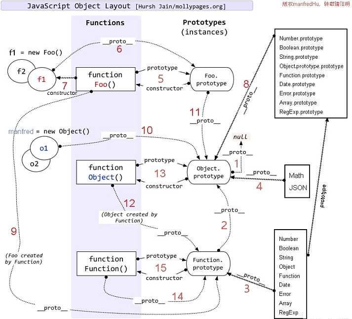
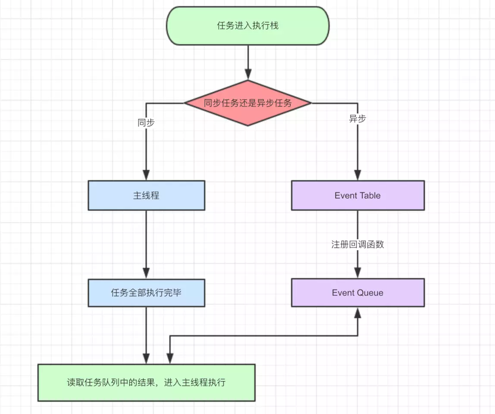
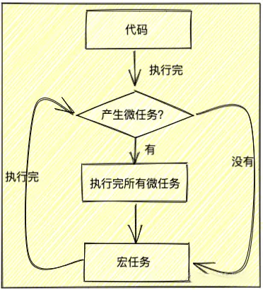

# Web前端

> 前端相关使用总结。  

> * [Axios](../frontend/axios.md)
> * [Html](../frontend/html.md)
> * [Css](../frontend/css.md)
> * [H5](../frontend/h5.md)
> * [移动端vw适配方案](../frontend/vw.md)
> * [Vue.js](../frontend/vuejs.md)
> * [Create React App](../frontend/cra.md)
> * [Vue Cli](../frontend/vue-cli.md)
> * [Js Utils](../frontend/js-utils.md)
> * [正则表达式](../frontend/regular.md)
> * [TypeScript](../frontend/typescript.md)
> * [ESLint](../frontend/eslint.md)
> * [Less](../frontend/less.md)
> * [Canvas](../frontend/canvas.md)
> * [防抖节流](../frontend/debounce-throttle.md)
> * [Webpack](../frontend/webpack.md)
> * [Nuxt.js](../frontend/nuxtjs.md)
> * [高德vue地图选择器](../frontend/amap-selector.md)
> * [VueQuillEditor](../frontend/vue-quill-editor.md)
> * [Chrome文件下载](../frontend/chrome-download.md)
> * [Vitejs](../frontend/vitejs.md)
> * [代码片段收藏](../frontend/snippet.md)

###### JavaScript原型链

###### JavaScript异步执行顺序

###### JavaScript宏任务&微任务执行流程

| 宏任务 |	浏览器 | Node |
|:-:|:-:|:-:|
| I/O | &#x2705; | &#x2705; |
| setTimeout | &#x2705; | &#x2705; |
| setInterval | &#x2705; | &#x2705; |
| setImmediate | &#x274C; | &#x2705; |
| requestAnimationFrame | &#x2705; | &#x274C; |

| 微任务 | 浏览器 | Node |
|:-:|:-:|:-:|
| Promise.prototype.then catch finally | &#x2705; | &#x2705; |
| process.nextTick | &#x274C; | &#x2705; |
| MutationObserver | &#x2705; | &#x274C; |

