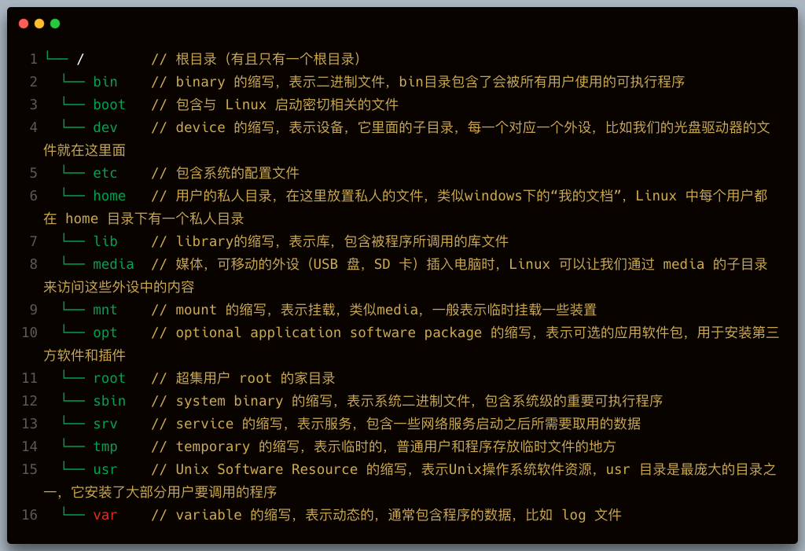

# Linux

> Linux系统下常用环境的安装以及相关配置，安装、配置、使用后总结。  

> * [命令行](../linux/cmd.md)
> * [yum](../linux/yum.md)
> * [JDK](../linux/jdk.md)
> * [PHP](../linux/php.md)
> * [Node.js](../linux/nodejs.md)
> * [Maven](../linux/maven.md)
> * [Nexus](../linux/nexus.md)
> * [MySQL](../linux/mysql.md)
> * [PostgreSQL](../linux/pgsql.md)
> * [挂载硬盘](../linux/mount.md)
> * [Nginx](../linux/nginx.md)
> * [Tomcat](../linux/tomcat.md)
> * [Redis](../linux/redis.md)
> * [MongoDB](../linux/mongodb.md)
> * [Solr](../linux/solr.md)
> * [RabbitMQ](../linux/rabbitmq.md)
> * [Ftp服务器](../linux/ftp.md)
> * [Jenkins](../linux/jenkins.md)
> * [禅道](../linux/zentao.md)

