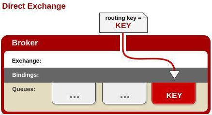
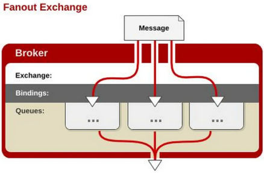
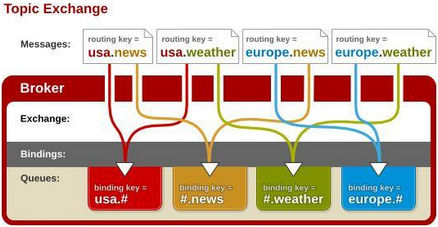
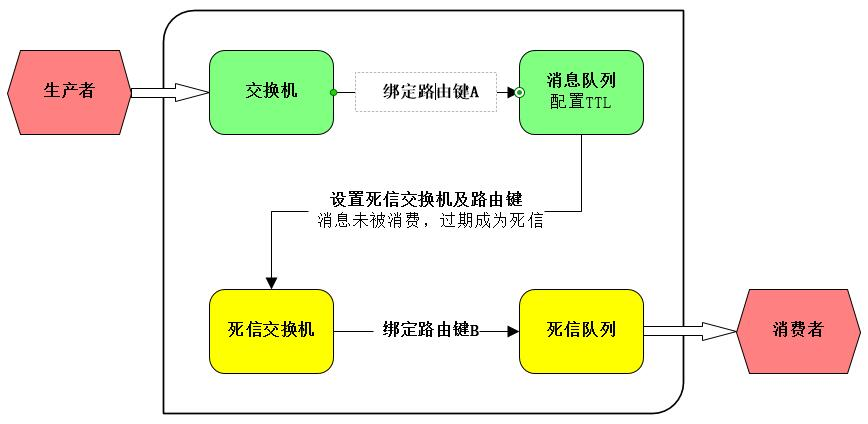

# RabbitMQ

#### 下载安装

> 下载对应版本的[erlang和rabbitmq-server](https://packagecloud.io/rabbitmq)  
> 注意：rabbitmq-server的el版本要跟erlang对应  

```bash
# 在linux下直接执行命令命令
wget --content-disposition https://packagecloud.io/rabbitmq/erlang/packages/el/7/erlang-23.3.4.5-1.el7.x86_64.rpm/download.rpm
wget --content-disposition https://packagecloud.io/rabbitmq/rabbitmq-server/packages/el/7/rabbitmq-server-3.8.19-1.el7.noarch.rpm/download.rpm
```

```bash
# 按顺序安装rpm包
yum -y install erlang-23.3.4.5-1.el7.x86_64.rpm
yum -y install rabbitmq-server-3.8.19-1.el7.noarch.rpm
```

#### 配置

> 新版本rabbitmq需单独创建[配置文件rabbitmq.conf](https://github.com/rabbitmq/rabbitmq-server/blob/v3.8.19/deps/rabbit/docs/rabbitmq.conf.example)  
> 下载地址：```https://github.com/rabbitmq/rabbitmq-server/blob/v版本号/deps/rabbit/docs/rabbitmq.conf.example```  

```bash
# 在/etc/rabbitmq/下，下载配置文件
cd /etc/rabbitmq/

# 创建配置文件
touch rabbitmq.conf

# 重命名配置文件，将配置复制到配置文件中
vim rabbitmq.conf

# 启用rabbitmq的管理平台插件，会在/etc/rabbitmq 目录下多出一个 enabled_plugins
cd /etc/rabbitmq/
rabbitmq-plugins enable rabbitmq_management

# 启动服务
systemctl start rabbitmq-server

# 停止服务
systemctl stop rabbitmq-server

# 开机自动启动
systemctl enable rabbitmq-server
```

#### 安装插件

> [社区插件列表](https://www.rabbitmq.com/community-plugins.html)  

```bash
# 查看已安装插件
rabbitmq-plugins list

# 未出现在列表中的插件需单独安装
cd /usr/lib/rabbitmq/lib/rabbitmq_server-3.8.19/plugins/

# 下载插件，如：延时队列插件
wget https://github.com/rabbitmq/rabbitmq-delayed-message-exchange/releases/download/3.8.17/rabbitmq_delayed_message_exchange-3.8.17.8f537ac.ez

# 启用插件，rabbitmq-plugins enable <插件名>
rabbitmq-plugins enable rabbitmq_delayed_message_exchange
```

#### 用户管理

```bash
# 需在rabbitmq-server启动状态下操作

# 添加用户
# rabbitmqctl add_user <用户名> <密码>
rabbitmqctl add_user admin admin

# 设置角色tags
# rabbitmqctl set_user_tags <用户名> <角色>
rabbitmqctl set_user_tags admin administrator

# 设置权限，可以远程访问，
# rabbitmqctl set_permissions -p "<Virtual host：/>" <用户名> "<Configure：.*>" "<Write：.*>" "<Read：.*>"
rabbitmqctl set_permissions -p "/" admin ".*" ".*" ".*"

# 查看用户列表
rabbitmqctl list_users

# 查看用户权限
rabbitmqctl list_permissions -p /

# 删除用户
# rabbitmqctl delete_user <用户名>
rabbitmqctl delete_user admin
```

#### RabbitMQ 基本概念


> 1、Message：消息，消息是不具名的，它由消息头和消息体组成。消息体是不透明的，而消息头则由一系列的可选属性组成，这些属性包括routing-key（路由键）、priority（相对于其他消息的优先权）、delivery-mode（指出该消息可能需要持久性存储）等。  
> 2、Publisher：消息的生产者，也是一个向交换器发布消息的客户端应用程序。  
> 3、Exchange：交换器，用来接收生产者发送的消息并将这些消息路由给服务器中的队列。  
> 4、Binding：绑定，用于消息队列和交换器之间的关联。一个绑定就是基于路由键将交换器和消息队列连接起来的路由规则，所以可以将交换器理解成一个由绑定构成的路由表。  
> 5、Queue：消息队列，用来保存消息直到发送给消费者。它是消息的容器，也是消息的终点。一个消息可投入一个或多个队列。消息一直在队列里面，等待消费者连接到这个队列将其取走。  
> 6、Connection：网络连接，比如一个TCP连接。  
> 7、Channel：信道，多路复用连接中的一条独立的双向数据流通道。信道是建立在真实的TCP连接内地虚拟连接，AMQP 命令都是通过信道发出去的，不管是发布消息、订阅队列还是接收消息，这些动作都是通过信道完成。因为对于操作系统来说建立和销毁 TCP 都是非常昂贵的开销，所以引入了信道的概念，以复用一条 TCP 连接。  
> 8、Consumer：消息的消费者，表示一个从消息队列中取得消息的客户端应用程序。  
> 9、Virtual Host：虚拟主机，表示一批交换器、消息队列和相关对象。虚拟主机是共享相同的身份认证和加密环境的独立服务器域。每个 vhost 本质上就是一个 mini 版的 RabbitMQ 服务器，拥有自己的队列、交换器、绑定和权限机制。vhost 是 AMQP 概念的基础，必须在连接时指定，RabbitMQ 默认的 vhost 是 / 。  
> 10、Broker：表示消息队列服务器实体。  

#### RabbitMQ 交换机

###### 1、Direct exchange---直接类型交换机



> 要求消息带的路由键和绑定的路由键**完全匹配**，这是一个完整的匹配；  
> 如果一个队列绑定到该交换机上要求路由键“abc”，则只有被标记为“abc”的消息才被转发，不会转发abc.def，也不会转发dog.ghi，只会转发abc。  

###### 2、Fanout Exchange---扇出类型交换机



> 只需将队列绑定到该类型交换机上，该类型的交换机绑定队列时可以不指定路由键(Routingkey)；  
> 当消息发送给该交换机后，它会将消息投递给与该交换机绑定的**所有队列**；  
> 很像子网广播，每台子网内的主机都获得了一份复制的消息。Fanout交换机转发消息是最快的。  

###### 3、Topic Exchange---主题类型交换机



> 使用通配符去匹配，路由到对应的队列。通配符有两种：```*``` 、```#``` 。需要注意的是通配符前面必须要加上"```.```"符号；  
> ```*``` 符号：有且只匹配一个词。比如：```a.*```可以匹配到"a.b"、"a.c"，但是匹配不了"a.b.c"；  
> ```#``` 符号：匹配一个或多个词。比如：```rabbit.#```既可以匹配到"rabbit.a.b"、"rabbit.a"，也可以匹配到"rabbit.a.b.c"。  

###### 4、Headers Exchange---首部交换机

> &#x1F44E;性能差&#x274C;不常用  
> 不处理路由键。而是根据发送的消息内容中的headers属性进行匹配；  
> 在绑定Queue与Exchange时指定一组键值对；当消息发送到RabbitMQ时会取到该消息的headers与Exchange绑定时指定的键值对进行匹配；如果完全匹配则消息会路由到该队列，否则不会路由到该队列；  
> headers属性是一个键值对，可以是Hashtable，键值对的值可以是任何类型；  
> 而fanout，direct，topic 的路由键都需要要字符串形式的；  
> 匹配规则```x-match```有下列两种类型：  
>  ```x-match = all```：表示所有的键值对都匹配才能接受到消息  
>  ```x-match = any```：表示只要有键值对匹配就能接受到消息  

#### 延时队列

###### 1、TTL + 死信队列



> 1、TTL队列，创建交换机（任意），创建队列并设置```x-dead-letter-exchange```，```x-dead-letter-routing-key```；  
> 2、死信队列，创建交换机（一般为```DirectExchange```），创建队列；  
> 3、注意TTL队列与死信队列之间的Routing key一致；  
> 4、只对死信队列进行监听消费，TTL队列无消费者超时自动投递到死信交换机，达到延时目的。  
> 注意：TTL时间可以在创建TTL队列时统一设置，也可以在发送消息时设置```expiration```，```message.getMessageProperties().setExpiration("5000")```  

###### 2、延时队列

> 1、安装并启用rabbitmq_delayed_message_exchange插件；  
> 2、创建自定义交换机，类型为```x-delayed-message```，参数需指定```x-delayed-type```，指定交换机为```topic```、```direct```、```fanout```、```headers```；  
> 3、创建队列与交换机绑定，监听队列进行消费；  
> 注意：延时事件在发送消息时设置```x-delay```，```message.getMessageProperties().setDelay(10 * 1000)```  

###### 注意

> 两种实现方式在发送消息时，设置延时时间方式的差异：  
> ```TTL + 死信队列```：通过```setExpiration```方法设置```expiration```  
> ```延时队列```：通过```setDelay```方法设置```x-delay```  