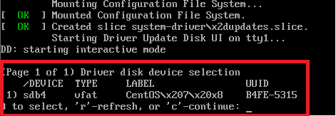

# 操作系统

### iso系统镜像

> CentOS系统镜像下载[请点击](https://www.centos.org/)  
> Windows系统镜像下载[请点击](https://msdn.itellyou.cn/)  

> iso镜像校验  

```bash
# 使用Windows下certutil工具，打开命令提示符使用以下命令
# Windows iso镜像需要SHA1
# CentOS iso镜像需要SHA256
certutil -hashfile <文件路径> MD5
certutil -hashfile <文件路径> SHA1
certutil -hashfile <文件路径> SHA256
```

### 创建USB安装盘

> Rufus下载地址[请点击](http://rufus.ie/)  

> Ventoy下载地址[请点击](https://www.ventoy.net/)👍  

> CentOS USB安装盘示例（以Rufus为例）  


> Windows USB安装盘示例（以Rufus为例）  


### CentOS安装

> 1、进入CentOS安装界面，按```TAB```键进入配置编辑（根据提示，uefi是按```E```键）  
> 2、将配置改为```vmlinuz initrd=initrd.img inst.stage2=hd......quiet```改为```vmlinuz initrd=initrd.img linux dd quiet```  
> 3、修改之后回车系统会进入磁盘设备列表，查看U盘的设备名，记住设备名（如下图所示，如：sdb4）  
> 4、按```CTRL + ALT + DEL```重启，进入安装界面  
> 5、按```TAB```编辑配置，改为```vmlinuz initrd=initrd.img inst.stage2=hd:/dev/sdb4 quiet```  
> 6、sdb4对应U盘的设备名，然后按回车进入图形安装界面  



### Windows安装

> 注意：DELL ChengMing3980 8代CPU，系统应为：UEFI+GPT+WIN10

### Windows10删除3D对象

> 注册表中删除```{0DB7E03F-FC29-4DC6-9020-FF41B59E513A}```

```
计算机\HKEY_LOCAL_MACHINE\SOFTWARE\Microsoft\Windows\CurrentVersion\Explorer\MyComputer\NameSpace

计算机\HKEY_LOCAL_MACHINE\SOFTWARE\Wow6432Node\Microsoft\Windows\CurrentVersion\Explorer\MyComputer\Namespace
```

### 右键 - 在此处打开命令窗口

> 注册表目录```计算机\HKEY_CLASSES_ROOT\Directory\Background\shell```  

```bash
# 1、shell项，右键 新建 项，命名为 cmd_shell

# 2、cmd_shell中设置
# (默认) -> 在此处打开命令窗口
# 新建 字符串值 -> Extended
# 新建 字符串值 -> Icon -> 值 -> cmd.exe
# 新建 项 -> command -> (默认) -> cmd.exe /s /k pushd "%V"
```

> 说明：  
> 字符串值 Extended：shift + 右键 才会显示   
