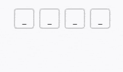
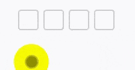

# 微信小程序验证码输入

> 微信小程序验证码输入，基于Taro@2.x React实现。  

###### 使用

```javascript
// 引入
import Timing from '_c/timing'

// 位数输入完后回调
onComplete = values => {
  // 数组
  console.log(values)
}

// render
<Codes length={4} onComplete={this.onComplete} />
```

#### 无光标闪烁动画版

> 根据```placeholder```设置占位符  




> index.jsx  

```javascript
import Taro, { Component } from '@tarojs/taro'
import PropTypes from 'prop-types'
import { View, Input } from '@tarojs/components'
import styles from './codes.module.scss'

/**
 * code输入
 */
class Codes extends Component {
  constructor () {
    this.state = {
      focus: false,
      value: '',
      values: []
    }
  }

  componentDidMount () {
    this.init()
  }

  init = () => {
    const { length, placeholder } = this.props
    this.setState({
      values: Array(length).fill(placeholder)
    })
  }

  setFocus = focus => {
    this.setState({ focus })
  }

  inputHandle = ({ detail }) => {
    let { value } = detail
    let { length } = this.props
    if (value.length > length) {
      value = value.substr(0, length)
    }
    this.setState({ value })
    const { values } = this.state
    value = value.split('')
    values.forEach((_, i) => {
      values[i] = value[i] || ''
    })
    this.setState({ values })
    if (value.length >= length) {
      this.setFocus(false)
      this.props.onComplete(values)
    }
  }

  render () {
    const { placeholder } = this.props
    const { focus, value, values } = this.state
    return (
      <View className={styles.component}>
        {values.map((val, i) => <View
          key={`code_${i}`}
          className={[styles.input, focus && styles.focus, !placeholder && (val ? styles.fill : styles.empty)]}
          onClick={() => this.setFocus(true)}
        >{val || placeholder}</View>)}
        <Input value={value} focus={focus} onBlur={() => this.setFocus(false)} onInput={this.inputHandle} />
      </View>
    )
  }
}

Codes.propTypes = {
  type: PropTypes.string,
  placeholder: PropTypes.string,
  length: PropTypes.number,
  onComplete: PropTypes.func
}

Codes.defaultProps = {
  type: 'number',
  placeholder: '',
  length: 4,
  onComplete: () => { }
}

export default Codes
```

> styles.module.scss  

```css
.component {
  display: flex;
  justify-content: center;
  align-items: center;
  overflow: hidden;
  position: relative;
  width: 100%;
  input {
    position: absolute;
    left: -999px;
  }
  .input {
    width: 80px;
    height: 80px;
    border: 2PX solid #CCC;
    font-size: 36px;
    color: #262626;
    font-weight: 600;
    border-radius: 12px;
    box-sizing: border-box;
    display: flex;
    justify-content: center;
    align-items: center;
    position: relative;
  }
  .input + .input {
    margin-left: 20px;
  }
  .focus.fill + .focus.empty,
  .focus.empty:first-child {
    &:after {
      content: '';
      display: block;
      width: 25%;
      height: 2PX;
      border-radius: 2PX;
      background-color: #AAA;
      position: absolute;
      left: 0;
      right: 0;
      bottom: 16px;
      margin: 0 auto;
    }
  }
}
```

#### 有光标闪烁动画版

> 根据```placeholder```设置占位符  



> index.jsx  

```javascript
import Taro, { Component } from '@tarojs/taro'
import PropTypes from 'prop-types'
import { View, Input } from '@tarojs/components'
import styles from './codes.module.scss'

/**
 * code输入
 */
class Codes extends Component {
  constructor() {
    this.state = {
      focus: false,
      value: '',
      values: [],
      animation: null,
      timer: null
    }
  }

  componentDidMount() {
    this.init()
  }

  componentWillUnmount () {
    const { timer } = this.state
    timer && clearInterval(timer)
  }

  init = () => {
    const { length } = this.props
    this.setState({
      values: Array(length).fill('')
    })
  }

  setFocus = focus => {
    this.setState({ focus })
    this.setAnimation(focus)
  }

  inputHandle = ({ detail }) => {
    let { value } = detail
    let { length } = this.props
    if (value.length > length) {
      value = value.substr(0, length)
    }
    this.setState({ value })
    const { values } = this.state
    value = value.split('')
    values.forEach((_, i) => {
      values[i] = value[i] || ''
    })
    this.setState({ values })
    if (value.length >= length) {
      this.setFocus(false)
      this.props.onComplete(values)
    }
  }

  setAnimation = (start = true) => {
    const { timer } = this.state
    timer && clearInterval(timer)
    if (start) {
      const animation = Taro.createAnimation({
        timingFunction: 'ease-in-out'
      })
      let next = true
      animation.opacity(1).step()
      animation.opacity(0).step()
      this.setState({
        animation: animation.export()
      })
      const newTimer = setInterval(() => {
        animation.opacity(next ? 0 : 1).step()
        next = !next
        this.setState({
          animation: animation.export()
        })
      }, 500)
      this.setState({ timer: newTimer })
    } else {
      this.setState({ timer: null, animation: null })
    }
  }

  render () {
    const { focus, value, values, animation } = this.state
    const cursorIndex = values.findIndex(val => !val)
    return (
      <View className={styles.component}>
        {values.map((val, i) => <View
          key={`code_${i}`}
          className={[styles.input]}
          onClick={() => this.setFocus(true)}
        >
          {val}
          {focus && cursorIndex !== -1 && (cursorIndex === i) && <View animation={animation}>_</View>}
        </View>)}
        <Input value={value} focus={focus} onBlur={() => this.setFocus(false)} onInput={this.inputHandle} />
      </View>
    )
  }
}

Codes.propTypes = {
  type: PropTypes.string,
  length: PropTypes.number,
  onComplete: PropTypes.func
}

Codes.defaultProps = {
  type: 'number',
  length: 4,
  onComplete: () => { }
}

export default Codes
```

> styles.module.scss  

```css
.component {
  display: flex;
  justify-content: center;
  align-items: center;
  overflow: hidden;
  position: relative;
  width: 100%;
  input {
    position: absolute;
    left: -999px;
  }
  .input {
    width: 80px;
    height: 80px;
    border: 2PX solid #CCC;
    font-size: 36px;
    color: #262626;
    font-weight: 600;
    border-radius: 12px;
    box-sizing: border-box;
    display: flex;
    justify-content: center;
    align-items: center;
  }
  .input + .input {
    margin-left: 20px;
  }
}
```
