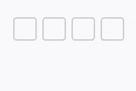

# 微信小程序验证码输入

> 微信小程序验证码输入，基于Taro@2.x React实现。  

### 使用

```javascript
// 引入
import Codes from '_c/codes'

// 位数输入完后回调
onInput = value => {
  // code字符串
  console.log(value)
}

// render
<Codes length={4} onInput={this.onInput} />
```

### 效果



> index.jsx  

```javascript
import Taro, { Component } from '@tarojs/taro'
import PropTypes from 'prop-types'
import { View, Input } from '@tarojs/components'
import styles from './codes.module.scss'

/**
 * code输入
 */
class Codes extends Component {
  constructor () {
    this.state = {
      focus: false,
      value: '',
      values: []
    }
  }

  componentDidMount () {
    this.init()
  }

  init = () => {
    const { length, autoFocus } = this.props
    this.setState({
      values: Array(length).fill('')
    })
    autoFocus && setTimeout(() => {
      this.setFocus(true)
    }, 100)
  }

  setFocus = focus => {
    this.setState({ focus })
  }

  inputHandle = ({ detail }) => {
    let { value } = detail
    let { length } = this.props
    if (value.length > length) {
      value = value.substr(0, length)
    }
    this.setState({ value })
    const { onInput } = this.props
    const { values } = this.state
    if (value.length < values.length) {
      onInput('')
    }
    value = value.split('')
    values.forEach((_, i) => {
      values[i] = value[i] || ''
    })
    this.setState({ values })
    if (value.length >= length) {
      this.setFocus(false)
      onInput(values.join(''))
    }
  }

  render () {
    const { focus, value, values } = this.state
    const cursorIndex = values.findIndex(val => !val)
    return (
      <View className={styles.component}>
        {values.map((val, i) => <View
          key={`code_${i}`}
          className={[styles.input, focus && cursorIndex !== -1 && (cursorIndex === i) && styles.cursor]}
          onClick={() => this.setFocus(true)}
        >{val}</View>)}
        <Input value={value} type='number' focus={focus} className={styles['real-input']} onBlur={() => this.setFocus(false)} onInput={this.inputHandle} />
      </View>
    )
  }
}

Codes.propTypes = {
  type: PropTypes.string,
  length: PropTypes.number,
  autoFocus: PropTypes.bool,
  onInput: PropTypes.func
}

Codes.defaultProps = {
  type: 'number',
  length: 4,
  autoFocus: false,
  onInput: () => { }
}

export default Codes
```

> styles.module.scss  

```css
.component {
  display: flex;
  justify-content: center;
  align-items: center;
  overflow: hidden;
  position: relative;
  width: 100%;
  .real-input {
    position: absolute;
    left: -999px;
  }
  .input {
    width: 80px;
    height: 80px;
    border: 2PX solid #CCC;
    font-size: 36px;
    color: #262626;
    font-weight: 600;
    border-radius: 12px;
    box-sizing: border-box;
    display: flex;
    justify-content: center;
    align-items: center;
    position: relative;
    &.cursor:after {
      content: '';
      display: block;
      width: 25%;
      height: 2PX;
      border-radius: 2PX;
      background-color: #999;
      position: absolute;
      left: 0;
      right: 0;
      bottom: 16px;
      margin: 0 auto;
      animation: cursor 1s ease-in-out infinite;
    }
  }
  .input + .input {
    margin-left: 20px;
  }
}
@keyframes cursor {
  0% {
    opacity: 1;
  }
  25% {
    opacity: .7;
  }
  50% {
    opacity: 0;
  }
  75% {
    opacity: .7;
  }
  100% {
    opacity: 1;
  }
}
```
