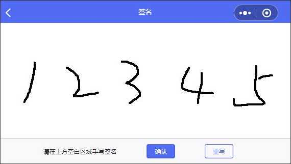

# 微信小程序Canvas签名

> 微信小程序Canvas手写签名，基于Taro@2.x React实现。  

#### 效果



> index.jsx  

```javascript
import Taro, { Component } from '@tarojs/taro'
import { View, Button, Text, Canvas } from '@tarojs/components'
import styles from './styles.module.scss'

/**
 * 手写签名
 */
class Index extends Component {
  constructor () {
    this.canvasRef = Taro.createRef()
    this.state = {
      ctx: null,
      isSigned: false,
      backgroundColor: '#FFF',
      lineColor: '#000',
      lineWidth: 4
    }
  }

  componentDidMount () {
    this.init()
  }

  config = {
    navigationBarTitleText: '签名',
    pageOrientation: 'landscape'
  }

  // 初始化
  init = () => {
    this.canvasRef.current.fields({ node: true, size: true }).exec(([res]) => {
      const canvas = res.node
      const ctx = canvas.getContext('2d')
      // 获取设备像素比
      const dpr = Taro.getSystemInfoSync().pixelRatio
      // 缩放设置canvas画布大小，防止笔迹错位
      canvas.width = res.width * dpr
      canvas.height = res.height * dpr
      ctx.scale(dpr, dpr)
      const { lineColor, lineWidth, backgroundColor } = this.state
      // 设置画布背景色
      ctx.fillStyle = backgroundColor
      ctx.fillRect(0, 0, canvas.width, canvas.height)
      // 设置线条颜色
      ctx.strokeStyle = lineColor
      // 设置线条宽度
      ctx.lineWidth = lineWidth
      // 设置笔迹开头结尾圆角
      ctx.lineCap = 'round'
      // 设置交汇处圆角
      ctx.lineJoin = 'round'
      this.setState({ ctx })
    })
  }

  // 开始绘制
  start = e => {
    const { ctx } = this.state
    if (e.type !== 'touchstart' || !ctx) return
    const { x, y } = e.changedTouches[0]
    ctx.moveTo(x, y)
    // 创建路径
    ctx.beginPath()
  }

  // 绘制
  move = e => {
    const { ctx, isSigned } = this.state
    if (e.type !== 'touchmove' || !ctx) return
    if (!isSigned) {
      // 如果签名状态为未签名，置为true
      this.setState({ isSigned: true })
    }
    const { x, y } = e.changedTouches[0]
    // 绘制笔迹
    ctx.lineTo(x, y)
    ctx.stroke()
    // 阻止默认事件
    e.preventDefault()
  }

  // 绘制结束
  end = e => {
    const { ctx } = this.state
    if (e.type !== 'touchend' || !ctx) return
    // 关闭路径
    ctx.closePath()
  }

  // 保存
  save = () => {
    const { ctx, isSigned } = this.state
    if (!ctx) return
    if (!isSigned) {
      Taro.showToast({
        title: '请先手写签名',
        icon: 'none',
        duration: 2000
      })
      return
    }
    const base64 = ctx.canvas.toDataURL()
    // TODO 对图片base64进行后续处理
    console.log(base64)

    /* 处理并关闭该页面，方法1
    // 使用mobx中formStore的setSignImage方法保存签名
    this.props.formStore.setSignImage(base64)
    Taro.navigateBack() */

    /* 处理并关闭该页面，方法2
    const pages = Taro.getCurrentPages()
    if (pages.length >= 2) {
      const prevPage = pages[pages.length - 2]
      // 调用前一页自定义的setSignImage方法保存签名到前一页
      prevPage.$component.setSignImage(base64)
      Taro.navigateBack()
    } */
  }

  // 清空画布
  clear = () => {
    const { ctx, backgroundColor } = this.state
    if (!ctx) return
    const { width, height } = ctx.canvas
    // 清空画布
    ctx.clearRect(0, 0, width, height)
    // 绘制画布背景颜色
    ctx.fillStyle = backgroundColor
    ctx.fillRect(0, 0, width, height)
    // 设置是否签名状态为false
    this.setState({ isSigned: false })
  }

  render () {
    return (
      <View className={styles.page}>
        <Canvas
          ref={this.canvasRef}
          type='2d'
          disable-scroll
          onTouchStart={this.start}
          onTouchMove={this.move}
          onTouchEnd={this.end}
        />
        <View className={styles.btns}>
          <Text>请在上方空白区域手写签名</Text>
          <View>
            <Button className={[styles.btn, styles.primary]} hoverClass={styles.hover} hoverStayTime={100} onClick={this.save}>确认</Button>
            <Button className={[styles.btn, styles.secondary]} hoverClass={styles.hover} hoverStayTime={100} onClick={this.clear}>重写</Button>
          </View>
        </View>
      </View>
    )
  }
}

export default Index
```

> styles.module.scss  

```css
.page {
  background-color: #F9F9FB;
  height: 100vh;
  width: 100vw;
  color: #262626;
  font-size: 0;
  overflow: hidden;
  display: flex;
  flex-direction: column;
  canvas {
    height: 82vh;
    width: 100vw;
  }
}
.btns {
  border-top: 1px solid #CCC;
  box-sizing: border-box;
  height: 18vh;
  display: flex;
  align-items: center;
  justify-content: center;
  >text {
    font-size: 16px;
  }
  >view {
    display: flex;
    justify-content: space-around;
    width: 300px;
    margin-left: 40px;
  }
}
.btn {
  font-size: 17px;
  border: 1PX solid #526BF3;
  border-radius: 6px;
  line-height: 1;
  display: flex;
  justify-content: center;
  align-items: center;
  padding: 10px 20px;
  &.primary {
    background-color: #526BF3;
    color: #FFF;
  }
  &.secondary {
    background-color: transparent;
    color: #526BF3;
  }
  &.hover {
    opacity: 0.6;
  }
}
```