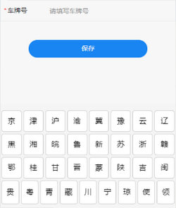

# 微信小程序车牌键盘

> 微信小程序车牌键盘。

#### 效果




#### 目录结构

```bash
├─ del.png    # 删除按钮
├─ index.js   # js
├─ index.json # json配置
├─ index.wxml # 视图
└─ index.wxss # 样式
```

#### del.png


#### index.js

```javascript
Component({
  externalClasses: ['v-panel'],
  properties: {
    isShow: {
      type: Boolean,
      value: false
    },
    buttonBorder: {
      type: String,
      value: '1px solid #ccc'
    },
    backgroundColor: {
      type: String,
      value: '#F5F5F5'
    },
    value: {
      type: String,
      value: '',
      observer: function (newVal) {
        this.setData({
          length: newVal.length
        })
      }
    }
  },
  data: {
    keyVehicle1: '京津沪渝冀豫云辽',
    keyVehicle2: '黑湘皖鲁新苏浙赣',
    keyVehicle3: '鄂桂甘晋蒙陕吉闽',
    keyVehicle4: '贵粤青藏川宁琼使领',
    keyNumber: '1234567890',
    keyEnInput1: 'QWERTYUIOPA',
    keyEnInput2: 'SDFGHJKLZXC',
    keyEnInput3: 'VBNM挂学警港澳',
    length: 0
  },
  methods: {
    vehicleTap: function (event) {
      let val = event.target.dataset.value
      switch (val) {
        case 'delete':
          this.triggerEvent('delete')
          break
        case 'ok':
          this.triggerEvent('ok')
          break
        default:
          this.triggerEvent('inputchange', val)
      }
    }
  }
})
```

#### index.json

```json
{
  "component": true
}
```

#### index.wxml

```html
<view wx:if="{{isShow}}" class="vehicle-panel" style="height:430rpx;background-color:{{backgroundColor}}">
  <!-- 省份简写键盘 -->
  <block wx:if="{{length <= 0}}">
    <view class="vehicle-panel-row">
      <view hover-class="vehicle-hover" hover-start-time="10" hover-stay-time="100" class='vehicle-panel-row-button' style="border:{{buttonBorder}}" wx:for="{{keyVehicle1}}" bindtap='vehicleTap' data-value="{{item}}" wx:for-index="idx" wx:key="idx">
        {{item}}
      </view>
    </view>
    <view class="vehicle-panel-row">
      <view hover-class="vehicle-hover" hover-start-time="10" hover-stay-time="100" class='vehicle-panel-row-button' style="border:{{buttonBorder}}" wx:for="{{keyVehicle2}}" bindtap='vehicleTap' data-value="{{item}}" wx:for-index="idx" wx:key="idx">
        {{item}}
      </view>
    </view>
    <view class="vehicle-panel-row">
      <view hover-class="vehicle-hover" hover-start-time="10" hover-stay-time="100" class='vehicle-panel-row-button' style="border:{{buttonBorder}}" wx:for="{{keyVehicle3}}" bindtap='vehicleTap' data-value="{{item}}" wx:for-index="idx" wx:key="idx">
        {{item}}
      </view>
    </view>
    <view class="vehicle-panel-row-last">
      <view hover-class="vehicle-hover" hover-start-time="10" hover-stay-time="100" class='vehicle-panel-row-button vehicle-panel-row-button-last' bindtap='vehicleTap' data-value="{{item}}" wx:for="{{keyVehicle4}}" style="border:{{buttonBorder}}" wx:for-index="idx" wx:key="idx">
        {{item}}
      </view>
    </view>
  </block>
  <!-- 英文键盘 -->
  <block wx:else>
    <view class="vehicle-panel-row">
      <view hover-class="vehicle-hover" hover-start-time="10" hover-stay-time="100" class='vehicle-panel-row-button vehicle-panel-row-button-number' bindtap='vehicleTap' data-value="{{item}}" wx:for="{{keyNumber}}" style="border:{{buttonBorder}}" wx:for-index="idx" wx:key="item">
        {{item}}
      </view>
      <view hover-class="vehicle-hover" style="border:{{buttonBorder}}" hover-start-time="10" hover-stay-time="100" class='vehicle-panel-row-button vehicle-panel-row-button-img'>
        <image src='./del.png' class='vehicle-en-button-delete' bindtap='vehicleTap' data-value="delete" mode='aspectFit'>
          删除
        </image>
      </view>
    </view>
    <view class="vehicle-panel-row">
      <view hover-class="vehicle-hover" hover-start-time="10" hover-stay-time="100" class='vehicle-panel-row-button' style="border:{{buttonBorder}}" wx:for="{{keyEnInput1}}" bindtap='vehicleTap' data-value="{{item}}" wx:for-index="idx" wx:key="idx">
        {{item}}
      </view>
    </view>
    <view class="vehicle-panel-row">
      <view hover-class="vehicle-hover" hover-start-time="10" hover-stay-time="100" class='vehicle-panel-row-button' style="border:{{buttonBorder}}" wx:for="{{keyEnInput2}}" bindtap='vehicleTap' data-value="{{item}}" wx:for-index="idx" wx:key="idx">
        {{item}}
      </view>
    </view>
    <view class="vehicle-panel-row-last">
      <view hover-class="vehicle-hover" hover-start-time="10" hover-stay-time="100" class='vehicle-panel-row-button vehicle-panel-row-button-last' bindtap='vehicleTap' style="border:{{buttonBorder}}" data-value="{{item}}" wx:for="{{keyEnInput3}}" wx:for-index="idx" wx:key="idx">
        {{item}}
      </view>
      <view hover-class="vehicle-hover" hover-start-time="10" hover-stay-time="100" class='vehicle-panel-row-button vehicle-panel-ok' bindtap='vehicleTap' data-value="ok">
        确定
      </view>
    </view>
  </block>
</view>
```

#### index.wxss

```css
.vehicle-panel {
	width: 100%;
	display: flex;
	flex-direction: column;
	justify-content: center;
	border-top: 1px solid #EEE;
	font-size: 32rpx;
	padding-top: 10rpx
}
.vehicle-panel-row {
	display: flex;
	justify-content: space-between;
	align-items: center
}
.vehicle-panel-row-last {
	display: flex;
	justify-content: space-between;
	align-items: center
}
.vehicle-panel-row-button {
	background-color: #fff;
	margin: 5rpx;
	padding: 5rpx;
	width: 80rpx;
	height: 80rpx;
	text-align: center;
	line-height: 80rpx;
	border-radius: 10rpx
}
.vehicle-panel-row-button-number {
	background-color: #DDD
}
.vehicle-panel-row-button-last {
	width: 90rpx;
	height: 90rpx;
	line-height: 90rpx
}
.vehicle-hover {
	background-color: #ccc
}
.vehicle-panel-row-button-img {
	display: flex;
	justify-content: center;
	align-items: center
}
.vehicle-en-button-delete {
	width: 55rpx;
	height: 85rpx
}
.vehicle-panel-ok {
	background-color: #1989fa;
	color: #fff;
	width: 150rpx;
	height: 80rpx
}
```