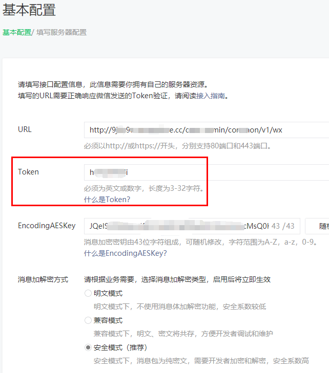

# 微信公众号

> 推荐使用内网穿透在开发阶段进行内网穿透，如：[cpolar](https://www.cpolar.com/)  


> Vue项目中通过内容穿透域名访问报错 ```Invalid Host header```，解决方法  

```javascript
// vue-cli@2.x修改webpack.dev.conf.js
devServer: {
  disableHostCheck: true,
}

// vue-cli@3.x以及4.x修改vue.config.js
module.exports = {
  devServer: {
    disableHostCheck: true
  }
}
```

> 正式环境需配置域名信息  


> 测试帐号申请，[请点击](https://mp.weixin.qq.com/debug/cgi-bin/sandbox?t=sandbox/login)  

### 服务器配置校验TOKEN



> 1）将token、timestamp、nonce三个参数进行字典序排序  
> 2）将三个参数字符串拼接成一个字符串进行sha1加密  
> 3）开发者获得加密后的字符串可与signature对比，标识该请求来源于微信  

```java
import cn.hutool.crypto.SecureUtil;

/**
 * 微信服务器配置token校验，URL处填写该接口访问路径
 * springboot
 */
@RequestMapping("/common")
public class CommonController {

    @GetMapping("/v1/wx/check")
    @ControllerExceptionHandler
    public String wxTokenCheck(
            @RequestParam("signature") String signature,
            @RequestParam("timestamp") String timestamp,
            @RequestParam("nonce") String nonce,
            @RequestParam("echostr") String echostr,
            HttpServletResponse response) {
        // 使用TreeSet字典序排序
        TreeSet<String> set = new TreeSet<>();
        set.add("TOKEN"); // 自己设置的TOKEN
        set.add(timestamp);
        set.add(nonce);
        StringBuilder sBuilder = new StringBuilder();
        for (String item : set) {
            sBuilder.append(item);
        }
        // sha1加密
        String sign = SecureUtil.sha1(sBuilder.toString());
        if (signature.equalsIgnoreCase(sign)) {
            return echostr;
        } else {
            return String.valueOf(false);
        }
    }
}
```